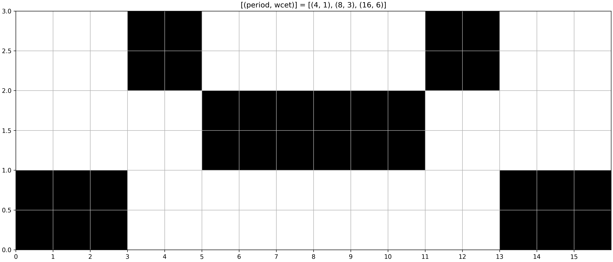
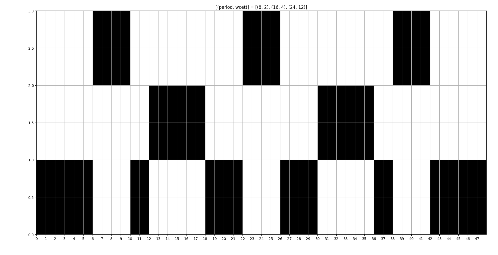
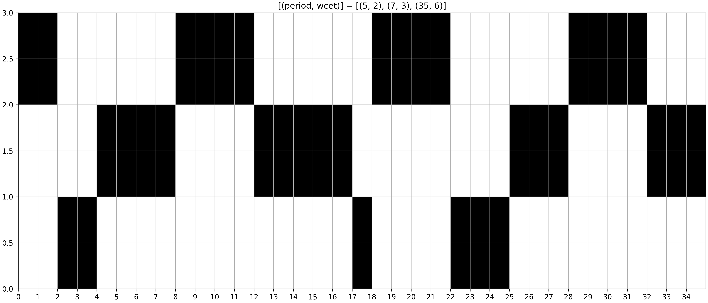
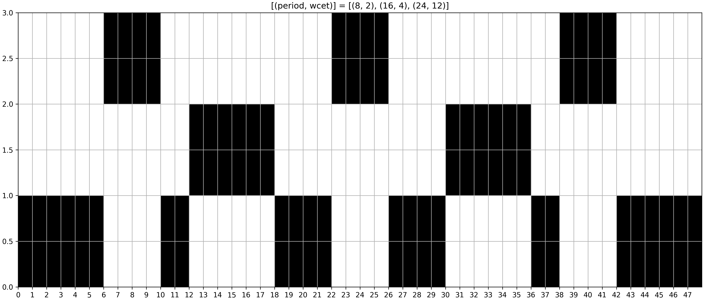
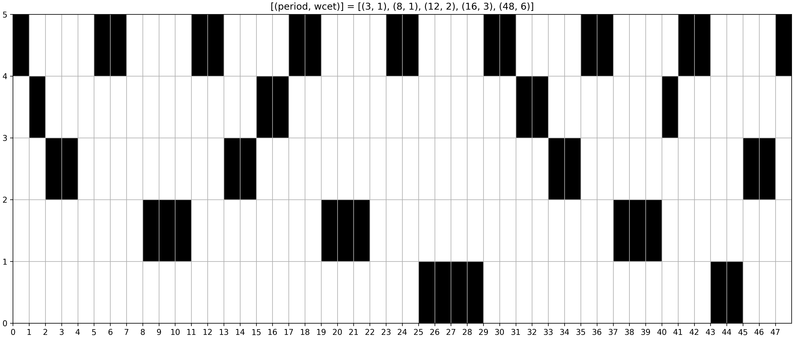
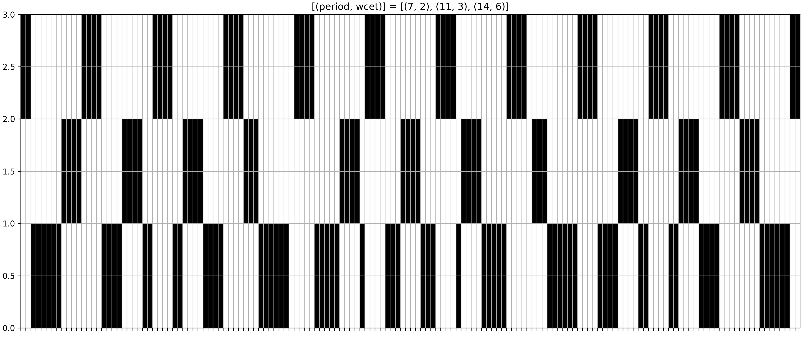
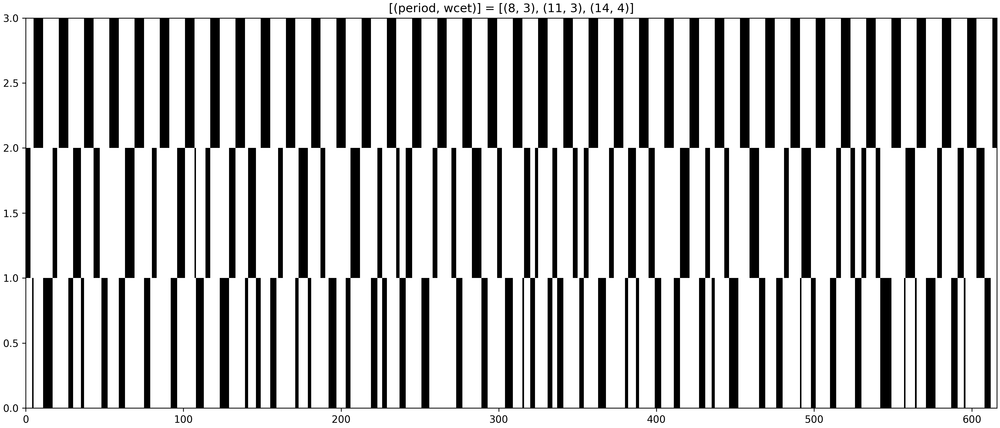
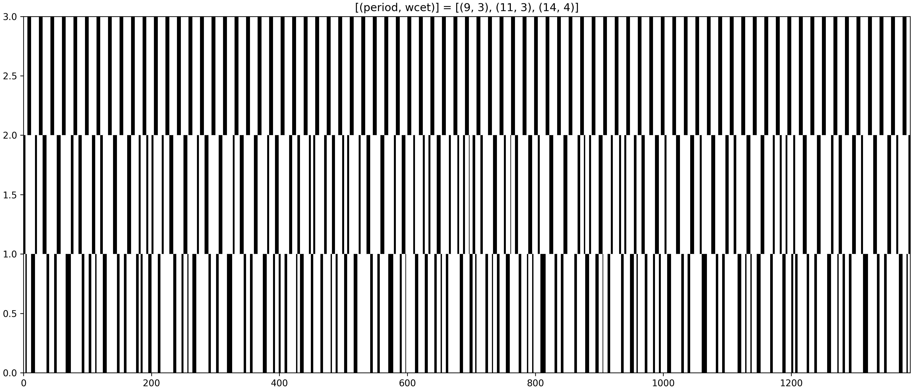

# Real time periodic task scheduling using Z3

This simple script is an attempt at finding real-time periodic
task schedules using Z3 SMT solver. Here is a small (harmonic)
task set schedule Z3 finds in less than a second:

Here is a slightly more "problematic" schedule:

More, slightly "bigger" task sets, still found in about a second:

Even bigger example found in 27 minutes (on AMD Ryzen 7 5700G):

and in 7 minutes:

The times needed for the bigger task sets might not seem impressive, but
finding a schedule in this setting is like searching in exponential space of size
2n_tasks &ast; hyper_period. In the last case it is 23 &ast; 1386...

